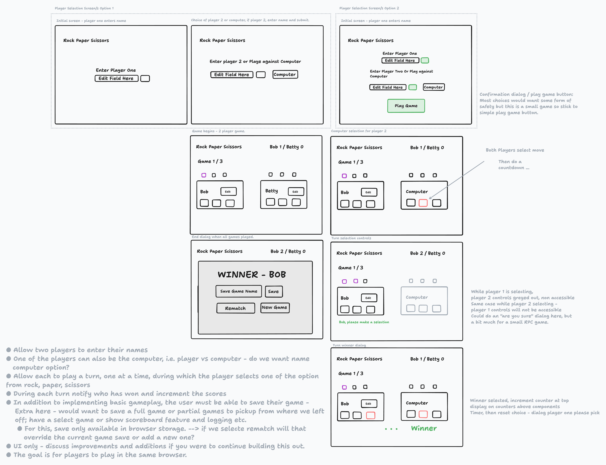

# Rock :rock: Paper :roll_of_paper: Scissors:scissors:

This project was generated with [Angular CLI](https://github.com/angular/angular-cli) version 17.3.6.

## Development server

Run `ng serve` for a dev server. Navigate to `http://localhost:4200/`. The application will automatically reload if you change any of the source files.

## Build

Run `ng build` to build the project. The build artifacts will be stored in the `dist/` directory.

## Running unit tests

I confess I did not add tests, but if you want to run any you can do so by running `ng test` to execute the generated tests by Angular Cli, using Karma. I tend to use to Jest and Angular Test Framework.

### Brief

A two player game of rock paper scissors, in which the second player can be the computer and both players can enter their names. Each player takes turns to select their move, afterwards they are notified of the current score, winner and their scores are incrementd.

From this I assumed the games round to be best 2 out of 3, but that is an option that could be extended in future. As are the player moves - Rock, Paper, Scissors, Lizard, Spock for example. This could open up to new win algorithms or turn orders such as round robin for this example.

Players must also be able to save their gameplay - for this I added a localStorage service which is quite basic but this can be extended and made more specific to the use case.

### Process

##### Low Level Wireframes

I'm quite visual so I mocked up some frames, unfortunately my end product does not reflect this exactly but sketching this out did help me think through some of the logic in the data flow and user interactions.

### Code Structure

The project is organised into several key components, services and models:

#### Models

**Move Enum:** The intention is to easily add more types of moves to the game.

**Player Interface:** Represent a current player.

**Round Interface:** Represent a round of the game - need to track players across rounds to get score of full game, etc.

**GameLog Interface:** Represent a log of the game - if saving the game is a feature it makes sense to keep a log of the game / state to load this or show a high scores board for example.

#### Components

The project is organised into several key components, services and models

##### GameComponent

* Description: This component manages the gameboard. It tracks players scores, who is winning and manages the logic around handling rounds. Most of this it does via RxJs Observables and Behavior Subjects and a GameService interface.  

* Key methods:

  * winner(): checks winning player for current round and whole game; resets round and finishes game.
  * rockPaperScissors(player1, player2): takes two players, outputs winner / undefined for draw.
  * updateSelectedMove(currentPlayer): takes player who selected move, updates selected in state

##### GameService

* Description:Central service for managing the core logic and interactions.

* Key Properties

  * Subjects and Observables:

    * playerInputSubject: tracks input from player for name update (post thinking about this, the name could be better).
    * errorMessageSubject: manages error messages.
    * playersSubject: holds current list of players for a round.
    * gameResetSubject: handles game reset
    * rondWinnerMessageSubject: manages message for round winner.
    * gameLogSubject: keeps track of the games log including rounds and final game state.

  * Observable Streams:

     For all of above, there is an observable - using a behavior subject means any subscriber will get the last event emitted value.
* Key Methods:

  * player Management via addPlayer() method
  * resetRound used to reset the state of the game
  * finishGames allows for the end of the game, updates the log
  * updateGameLog and getGameLog to manage the game log
  * saveGame updates the localStorage with the latest game

    There are several utility methods also.

#### MoveSelectorComponent and PlayerInputComponent

  The MoveSelectorComponent is used to  allow for one set of moves per player and the controls for this. The idea being that, we can have a list of moves and pass these to MoveSelectorComponent, iterate through them and display them all. As well as keeping this a contained component which controls moves for a single player.

  The PlayerInputComponent and the Welcome component are both there for the player selection screen. These are responsible for creating the initial players.
